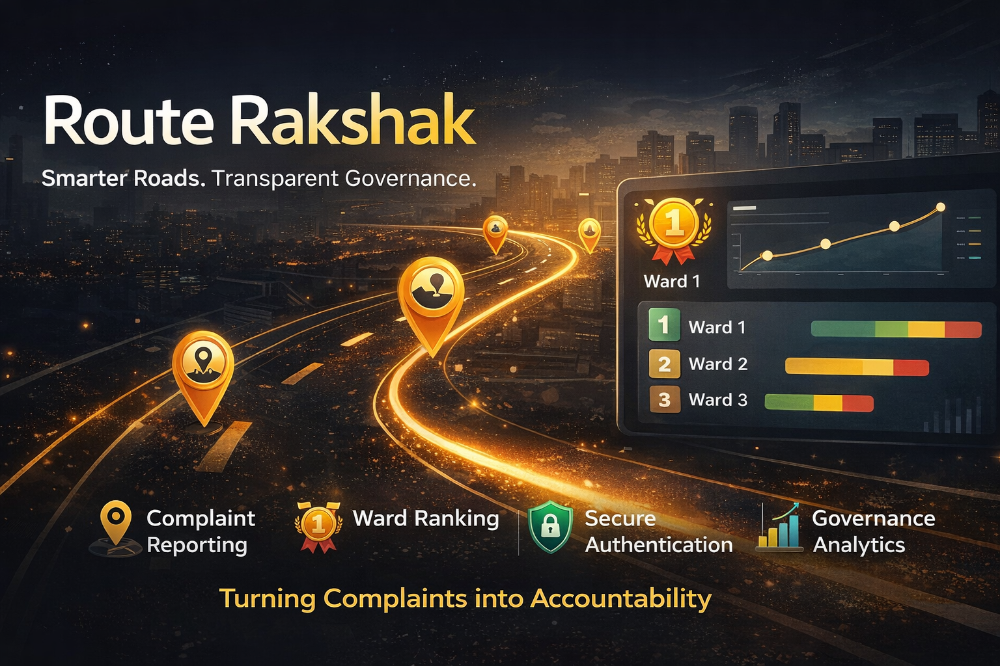

<p align="center">
  
</p>

# 🛣️ Route Rakshak  
### Smarter Roads. Transparent Governance.


---

## 📌 Overview

Route Rakshak is a civic-tech platform designed to improve road and infrastructure management through citizen participation and data-driven ward performance tracking.  

It transforms traditional complaint systems into an intelligent governance tool that promotes transparency, accountability, and faster resolution of civic issues.

---

## 🚀 Problem Statement

Urban infrastructure complaint systems often suffer from:

- Delayed responses from authorities  
- Lack of transparency  
- No ward-level performance tracking  
- Weak accountability mechanisms  
- No structured comparison between administrative units  

Existing systems allow complaint registration but rarely convert that data into actionable governance insights.

---

## 💡 Our Solution

Route Rakshak introduces a smart civic monitoring platform that:

- Enables citizens to report infrastructure issues  
- Tracks complaints systematically  
- Implements an automated ward ranking system  
- Encourages performance-driven governance  
- Promotes transparency through measurable metrics  

Instead of being just a complaint portal, Route Rakshak acts as a **Governance Intelligence System**.

---

## ✨ Key Features

### 👤 Citizen Portal
- Secure registration & login  
- Ward selection & update  
- Complaint submission  
- Complaint tracking  
- Session-based authentication  

### 🏆 Ward Ranking System
- Automatic ward performance recalculation  
- Ranking based on complaint resolution efficiency  
- Encourages healthy administrative competition  

### 🗺️ Map Integration
- Location-based complaint representation  
- Visual monitoring of infrastructure issues  

### 🔐 Security
- Password hashing using bcrypt  
- Session-based authentication  
- Protected backend routes  

---

## 🏗️ System Architecture

Route Rakshak follows a modular multi-panel architecture with clear separation of concerns.

### 📌 Architecture Layers

#### 1️⃣ Client Layer
- Built using EJS templates  
- Handles UI rendering  
- Sends requests to backend  
- Session-based authentication  

#### 2️⃣ Server Layer (Node.js + Express)
- Handles routing logic  
- Manages authentication  
- Processes complaint submissions  
- Updates ward rankings  
- Controls session management  
- Implements middleware security  

#### 3️⃣ Database Layer (MongoDB + Mongoose)
- Stores citizen data  
- Stores complaint records  
- Stores ward & ranking data  
- Maintains relational references via ObjectIds  

#### 4️⃣ Ranking Engine
- Recalculates ward performance  
- Evaluates complaint resolution rates  
- Updates rankings dynamically  
- Ensures data consistency  

---

## 📊 Data Flow

1. Citizen logs in  
2. Complaint is submitted  
3. Complaint stored in MongoDB  
4. Ward statistics updated  
5. Ranking recalculated  
6. Dashboard reflects updated performance  

---

## 📂 Project Structure


## 📂 Project Structure

```bash
RouteRakshak/
│
├── backend/          # Core server logic & database models
├── citizen-panel/    # Citizen-facing interface
├── admin-panel/      # Administrative dashboard
├── assets/           # Banner & screenshots
├── LICENSE
├── .env.example
└── README.md


## 🏗️ Tech Stack

### Backend
- Node.js  
- Express.js  
- MongoDB  
- Mongoose  

### Frontend
- EJS  
- HTML  
- CSS  
- JavaScript  

### Security
- bcrypt  
- express-session  

### Deployment
- Render  

### Version Control
- GitHub  

---

## ⚙️ Installation & Setup

```bash
git clone https://github.com/Tejwardeep-Singh/RouteRakshak.git
cd route-rakshak
npm install

Create a .env file:

MONGO_URI=your_mongodb_connection_string
SESSION_SECRET=your_secret_key
PORT=3000

Start the server:

for citizen portal--

cd backend
npx nodemon app-citizen.js

for admin portal

cd backend
npx nodemon app-admin.js

Server runs on:

http://localhost:3000 ---- citizen portal

http://localhost:4000 ---- admin portal

🚀 Live Demo

Citizen Portal:
https://routerakshak.onrender.com/

Admin Panel:
https://routerakshakadmin.onrender.com/admin

🎯 Innovation

The core innovation of Route Rakshak lies in transforming complaint data into measurable governance metrics.

Unlike traditional civic portals that only log complaints, Route Rakshak:

Introduces automated ward ranking

Creates performance-driven accountability

Enables comparative governance analysis

Bridges citizen participation with administrative evaluation

📈 Future Scope

AI-based complaint prioritization

Mobile application version

Real-time analytics dashboard

Integration with municipal systems

Predictive infrastructure damage detection

Geo-fencing for automatic ward detection

🌍 Impact

Route Rakshak aims to:

Strengthen citizen engagement

Improve infrastructure response time

Enhance governance transparency

Promote data-driven decision making

Build trust between citizens and authorities

👥 Contributors

Tejwardeep Singh – Project Manager

Eklavya – Backend Developer

Snehdeep Kaur – Designer

Aemryene Sandhu – Designer

📜 License

This project is licensed under the MIT License – see the LICENSE
 file for details.

🏁 Conclusion

Route Rakshak reimagines civic complaint systems by combining citizen participation with measurable governance performance.

It is not just a reporting platform — it is an accountability engine designed to build smarter, more transparent cities.